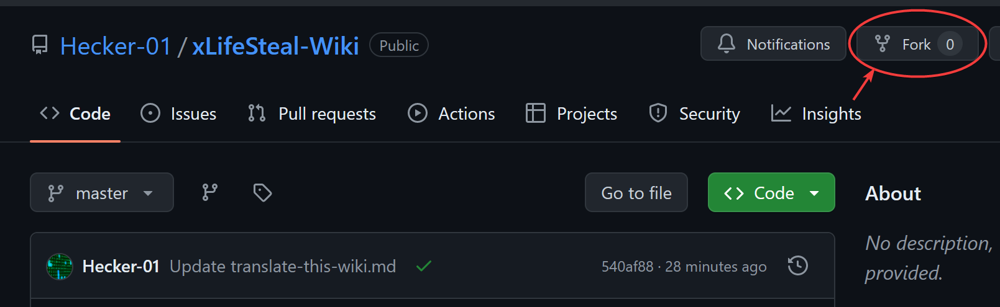
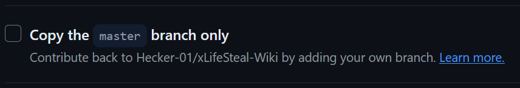
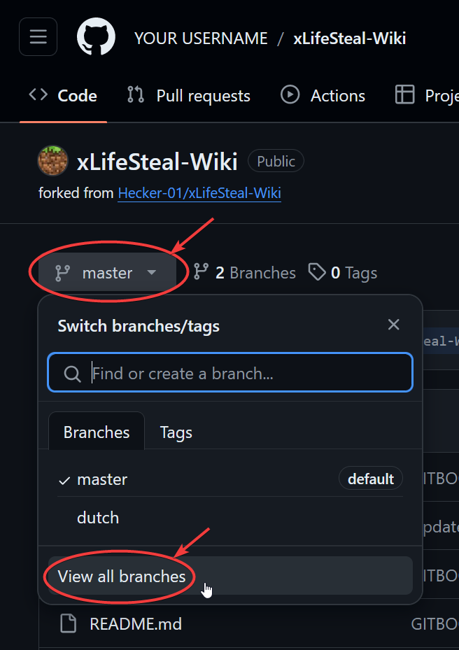
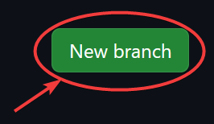
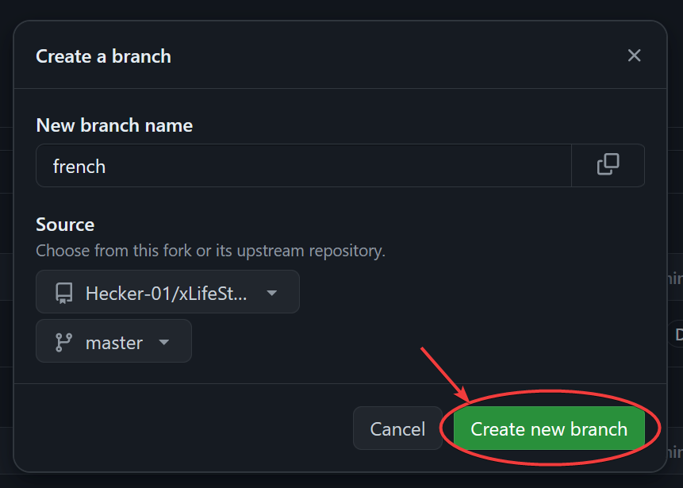
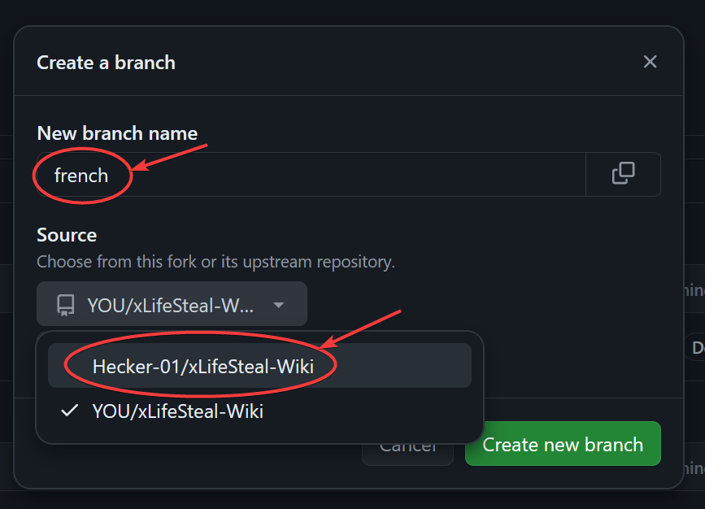
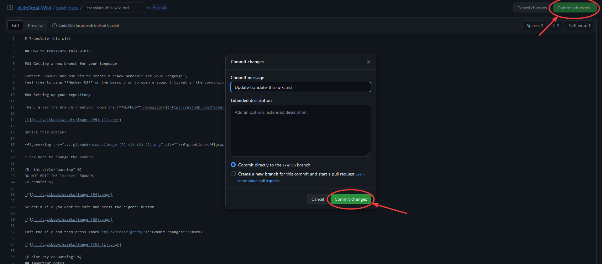
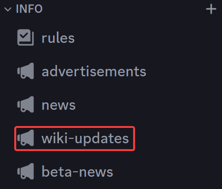

# Translate this wiki

## How to translate this wiki?

### Getting a new branch for your language

Contact LoneDev and ask him to create a **new branch** for your language.\
Feel free to ping **Hecker\_01** on the Discord or to open a support ticket in the community channel.

### Setting up your repository

Then, after the branch creation, open the [**Github** repository](https://github.com/hecker-01/xLifeSteal-Wiki) of this wiki, press on **`Fork`**.

Untick this option!

<figure><figcaption></figcaption></figure>

Click here to add a new branch.


DO NOT EDIT THE `master` BRANCH!
But create a new branch!


In this example we make a french translation and also a new `french` branch.


Select a file you want to edit and press the **pen** button

Edit the file and then press <mark style="color:green;">**Commit changes**</mark>

## Important notes

* Do not add content or new pages, only translate texts.
* The only content you can add is a "translated by" text in the welcome page.
* Do not remove the `#` special characters, translate only the next text, these are titles.
* Do not remove or edit special texts inside `{ }`, for example \`


\`, these are used to create the hint message boxes.

* Do not remove `*` character, these are used to create lists
* Do not remove emojis
* Do not translate or remove the `--- description: ---` text on top of some pages, translate only the inner text.
* Do not remove `\` on some lines end
* Do not remove `[TEXT](LINK)` part, translate only the text, these are the clickable links.


### Last step

Contact **Hecker\_01** in order to get your changes reviewed and added to the wiki.\
Feel free to ping **Hecker\_1** on the [Discord](https://discord.gg/8ukXVGemBB) or to open a support ticket in the community channel.


Would be good if you update your translation each time the main repository (the one in English) gets edited, to reflect changes.\
You can keep track of changes in the Discord notification channel.


